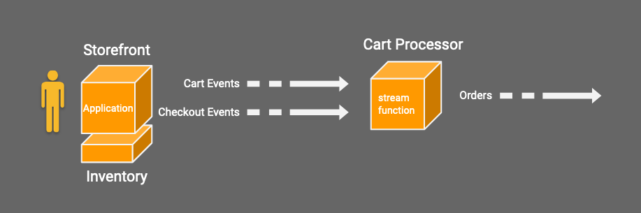

# Projectriff Shopping Demo

In this demo we will build a music store ecommerce application by using project riff. The high level architecture of this demo is as follows:



## Initial Setup

### Software prerequisites

Have the following installed:

- [kubectl](https://kubernetes.io/docs/tasks/tools/install-kubectl/) version v1.15 or later
- [kapp](https://github.com/k14s/kapp#kapp) version v0.15.0 or later
- [ytt](https://github.com/k14s/ytt#ytt-yaml-templating-tool) version v0.22.0 or later
- [helm](https://github.com/helm/helm#install) Helm v2, recommend using v2.16.1 or later

### Install riff CLI

You need the latest [riff CLI](https://github.com/projectriff/cli/). You can run the following commands to download the latest snapshot executable archive for your OS, extract the executable and then place it on your path.

#### Download and extract the riff CLI executable

For macOS:

```
wget https://storage.googleapis.com/projectriff/riff-cli/releases/v0.5.0-snapshot/riff-darwin-amd64.tgz
tar xvzf riff-darwin-amd64.tgz
rm riff-darwin-amd64.tgz
```

for Linux:

```
wget https://storage.googleapis.com/projectriff/riff-cli/releases/v0.5.0-snapshot/riff-linux-amd64.tgz
tar xvzf riff-linux-amd64.tgz
rm riff-linux-amd64.tgz
```

#### Move the riff CLI executable to your PATH

```
sudo mv ./riff /usr/local/bin/riff
```

### Kubernetes cluster

Follow the riff instructions for:

- [GKE](https://projectriff.io/docs/v0.5/getting-started/gke)
- [Minikube](https://projectriff.io/docs/v0.5/getting-started/minikube)
- [Docker Desktop](https://projectriff.io/docs/v0.5/getting-started/docker-for-mac)

### Initialize the Helm Tiller server in your cluster

```
kubectl create serviceaccount tiller -n kube-system
kubectl create clusterrolebinding tiller --clusterrole cluster-admin --serviceaccount kube-system:tiller
helm init --wait --service-account tiller
```

### Add the incubator charts to your helm configuration

```
helm repo add incubator http://storage.googleapis.com/kubernetes-charts-incubator
```

### Install NGINX Ingress Controller for a local cluster

On local clusters that don't provide support for `LoadBalancer` services we need to enable NGINX Ingress Controller so we can access the service URLs without specifying the node port for the Istio ingress gateway.

#### NGINX Ingress on Docker Desktop

> NOTE: We are taking advantage of Docker Desktop supporting a single `LoadBalancer` service and exposing that on port 80 on `localhost`. To be able to use this feature it requires that you don't already have a service running on this port.

Install NGINX Ingress using:

```
helm install --name nginx-ingress --namespace nginx-ingress stable/nginx-ingress --wait
```

The NGINX ingress controller is exposed as LoadBalancer with external IP address. For "Docker Desktop" it should be exposed on port 80 on `localhost`.

Run the following to verify:

```
kubectl get services --namespace nginx-ingress
```

#### NGINX Ingress on Minikube

Install NGINX Ingress using:

```
minikube addons enable ingress
```

The NGINX ingress controller is exposed on port 80 on the minikube ip address

### Install riff

Install riff with Knative and Streaming runtimes plus their dependencies.

1. Follow the instructions for your Kubernetes installation from the [riff getting started guides](https://projectriff.io/docs/latest/getting-started). This installs riff Build and required dependencies plus the Knative Runtime and its dependencies.

1. Install the Streaming runtime by following instructions in the [Streaming Runtime Install section](https://projectriff.io/docs/latest/runtimes/streaming#install).

### Add ingress rule for istio-ingressgateway for a local cluster

On local clusters that don't provide support for `LoadBalancer` services we need to add an ingress rule to redirect to the `istio-ingressgateway`.

```
cat <<EOF | kubectl apply -f -
apiVersion: networking.k8s.io/v1beta1
kind: Ingress
metadata:
  name: istio-ingress
  namespace: istio-system
  annotations:
    nginx.ingress.kubernetes.io/rewrite-target: /
spec:
  backend:
    serviceName: istio-ingressgateway
    servicePort: 80
EOF
```

### Add Docker Hub credentials for builds

```
DOCKER_USER=$USER
riff credentials apply docker-push --docker-hub $DOCKER_USER --set-default-image-prefix
```

## Run the demo

#### Look up ingress

For GKE:

```
export INGRESS=$(kubectl get svc/istio-ingressgateway -n istio-system -ojsonpath='{.status.loadBalancer.ingress[0].ip}')
```

For Docker Desktop:

```
export INGRESS=$(kubectl get svc/nginx-ingress-controller -n nginx-ingress -ojsonpath='{.status.loadBalancer.ingress[0].hostname}')
```

For Minikube:

```
export INGRESS=$(minikube ip)
```

### Install inventory database

```
helm install --name inventory-db --namespace default --set postgresqlDatabase=inventory stable/postgresql --wait
```

> NOTE: If you delete the database using `helm delete --purge inventory-db` then you also need to clear the persistent volume claim for the database, or you won't be able to log in if you create a new database instance with the same name.
>
> Delete the PVC with `kubectl delete pvc data-inventory-db-postgresql-0`.

### Install kafka

We create a single node Kafka instance in the `kafka` namespace.

```
helm install --name kafka --namespace kafka incubator/kafka --set replicas=1 --set zookeeper.replicaCount=1 --wait
```

### Create kafka-provider

```
riff streaming kafka-gateway create franz --bootstrap-servers kafka.kafka:9092
```

### Build inventory-api app

For build instruction see: https://github.com/projectriff-demo/inventory-management/blob/master/README.md

We have a pre-built image available as `projectriffdemo/inventory-api` and will use that for these instructions.

```
riff container create inventory-api --image projectriffdemo/inventory-api:latest
```

### Deploy inventory-api service

```
riff knative deployer create inventory-api --container-ref inventory-api \
  --min-scale 1 \
  --ingress-policy External \
  --env SPRING_PROFILES_ACTIVE=cloud \
  --env SPRING_DATASOURCE_URL=jdbc:postgresql://inventory-db-postgresql:5432/inventory \
  --env SPRING_DATASOURCE_USERNAME=postgres \
  --env-from SPRING_DATASOURCE_PASSWORD=secretKeyRef:inventory-db-postgresql:postgresql-password \
  --tail
```

### Load some test data

We set the `INGRESS` variable previously and  we can issue curl commands to access the api and add some articles:

```
curl -i -X POST -H "Content-Type:application/json" -H "Host: inventory-api.default.example.com" ${INGRESS}/api/article --data '{"sku" : "12345-00001", "name" : "Trumpet", "description" : "A fine musical instrument, perfect for playing Jazz riffs.", "priceInUsd" : 545, "imageUrl" : "https://free-images.com/tn/4fa5/trumpet_music_brass_orchestra.jpg", "quantity" : 3}'
curl -i -X POST -H "Content-Type:application/json" -H "Host: inventory-api.default.example.com" ${INGRESS}/api/article --data '{"sku" : "12345-00002", "name" : "Guitar", "description" : "A nice guitar, great for riffing.", "priceInUsd" : 315, "imageUrl" : "https://free-images.com/sm/1b40/guitar_electric_guitar_music.jpg", "quantity" : 7}'
curl -i -X POST -H "Content-Type:application/json" -H "Host: inventory-api.default.example.com" ${INGRESS}/api/article --data '{"sku" : "12345-00003", "name" : "Drums", "description" : "A good set of drums for riffing with your buddies.", "priceInUsd" : 229, "imageUrl" : "https://free-images.com/sm/c7b2/drums_music_cymbal_brass.jpg", "quantity" : 2 }'
```

### Access inventory-api service

We set the `INGRESS` variable previously and  we can issue curl command to access the api to list the inventory:

```
curl ${INGRESS}/api/article -H "Host: inventory-api.default.example.com" -H 'Accept: application/json' && echo
```

### The shopping streams

#### Create three streams

```
riff streaming stream create cart-events --gateway franz --content-type 'application/json'
riff streaming stream create checkout-events --gateway franz --content-type 'application/json'
riff streaming stream create orders --gateway franz --content-type application/json
```

#### Create an events-api HTTP source

Create a `container` resource using the HTTP Source image:

```
riff container create http-source --image 'gcr.io/projectriff/http-source/github.com/projectriff/http-source/cmd:0.1.0-snapshot-20191127171015-8b9d7934ec77a183'
```

Lookup the gateway name for the kafka-gateway:

```
gateway=$(kubectl get svc --no-headers -o custom-columns=NAME:.metadata.name \
  -l streaming.projectriff.io/kafka-gateway=franz)
```

Once we have the `gateway` variable set, we can create the HTTP source:

```
riff knative deployer create events-api --container-ref http-source \
  --min-scale 1 \
  --ingress-policy External \
  --env OUTPUTS=/cart-events=${gateway}:6565/default_cart-events,/checkout-events=${gateway}:6565/default_checkout-events \
  --env OUTPUT_CONTENT_TYPES=application/json,application/json \
  --tail
```

### Build storefront app

For build instruction see: https://github.com/projectriff-demo/storefront/blob/master/README.md

We have a pre-built image available as `projectriffdemo/storefront` and will use that for these instructions.

```
riff container create storefront --image projectriffdemo/storefront:latest
```

### Deploy storefront service

```
riff knative deployer create storefront --container-ref storefront \
  --target-port 4200 \
  --min-scale 1 \
  --ingress-policy External \
  --tail
```

Add an entry in `/etc/hosts` for `storefront.default.example.com`.

Enter the IP address for the entry based on the following:

For GKE:

```
kubectl get svc/istio-ingressgateway -n istio-system -ojsonpath='{.status.loadBalancer.ingress[0].ip}' && echo
```

For Docker Desktop:

`127.0.0.1`


For Minikube:

```
minikube ip
```

### Build cart processing function

```
riff function create cart \
  --git-repo https://github.com/projectriff-demo/cart-processor.git \
  --handler io.projectriff.cartprocessor.CartProcessor \
  --tail
```

### Create a stream processor for the cart

If you built the function yourself, then use this command to create the processor:

```
riff streaming processor create cart \
  --function-ref cart \
  --input cart-events \
  --input checkout-events \
  --output orders \
  --tail
```

If you didn't build the function, then can you use a pre-built image available as `projectriffdemo/cart`:

```
riff container create cart --image projectriffdemo/cart:latest
riff streaming processor create cart \
  --container-ref cart \
  --input cart-events \
  --input checkout-events \
  --output orders \
  --tail
```

### Watch the orders stream

Set up role bindings for dev-utils:

```
kubectl create clusterrolebinding dev-util-stream --clusterrole=riff-streaming-readonly-role --serviceaccount=default:default
kubectl create clusterrolebinding dev-util-core --clusterrole=riff-core-readonly-role --serviceaccount=default:default
kubectl create clusterrolebinding dev-util-knative --clusterrole=riff-knative-readonly-role --serviceaccount=default:default

kubectl create role view-secrets-role --resource secrets --verb get,watch,list
kubectl create rolebinding dev-util-secrets --role=view-secrets-role --serviceaccount=default:default
```

Run dev-utils pod:

```
kubectl run dev-utils --image=projectriff/dev-utils:0.5.0-snapshot-20200116110522-3c8772342bd5cc9f --generator=run-pod/v1
```

Subscribe to the orders:

```
kubectl exec dev-utils -it -- subscribe orders --payload-as-string
```
> Hit `ctrl-c` to stop subscribing

### Go shopping!

Open http://storefront.default.example.com in your browser.

## Some additional functions to experiment with

- [trend-detector](trend-detector.md)
- [no-buy-detector](no-buy-detector.md)

## Manually testing streams and events-api

See the [Manually testing streams and events-api](manual-test.md)
